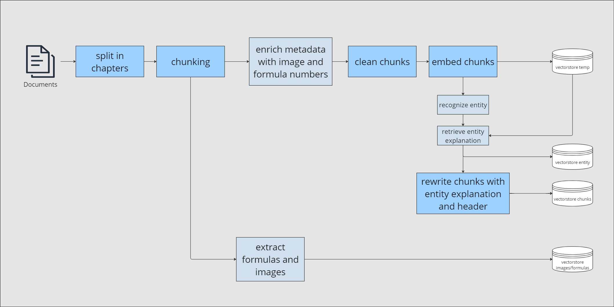
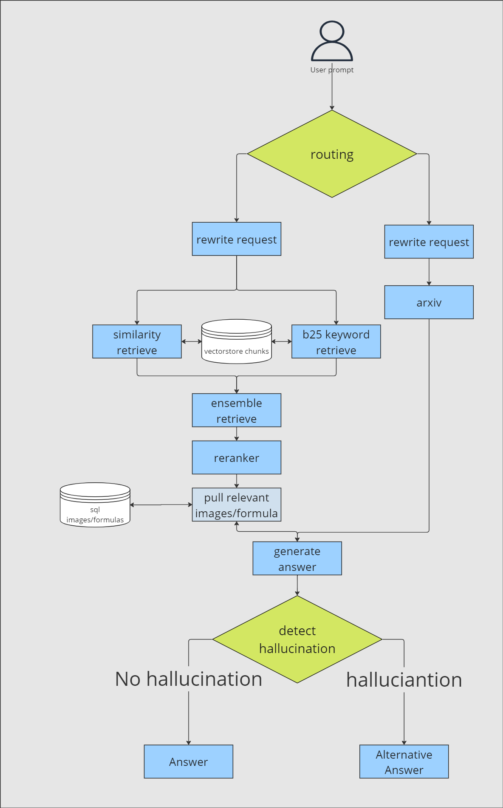

# Multi Agent RAG Web Application for  🧠📚

An advanced Retrieval-Augmented Generation (RAG) solution designed to tackle complex questions that simple semantic similarity-based retrieval cannot solve. This project showcases a sophisticated system with multiple agents and advanced RAG techniques capable of answering non-trivial questions from data.


## 🌟 Key Features

- **Intelligent Chunking and Chunk Cleaning**: Split documents by chapters and split into chunks with overlap.
- **Optimising Chunk Content**: Rewrites chunk and adds a chunk header for optimal information retrieval
- **Optimised document retrieval**: Implemented query revision, ensemble retriever and reranker.
- **Adaptive Planning**: Use agents to determine best plan to handle queries.
- **Hallucination Detection**: Detects hallucination and chooses fitting actions.
- **Performance Evaluation**: Utilizes `Ragas` metrics for comprehensive quality assessment.
- **Centralized Prompt Management**: Uses Jinja2 templates for flexible and maintainable prompts.
- **Structured Output Validation**: Implements Pydantic and Instructor for robust output validation.
- **Centralized Model Factory**: Unified creation of LLM and embedding models for consistency.


## 🧠 How It Works


1. **PDF Loading and Processing**: Load PDF document and split into chapters.
2. **Text Preprocessing**: Clean and preprocess the text for better encoding.
3. **Optimize Chunk Text**: Generate new chunk content in an optimized way with a chunk header.
4. **Vector Store Encoding**: Encode the chunks into vector stores for efficient retrieval.
5. **Choose the Correct Database**:
   - Choose the vectorstore for questions regarding theory and general kknowledge on machine learning and deep learing
   - Choose Arxiv for questions about specific topics or current research
6. **Optimize Query**: Rewrite the query for optimal retrieval performance
7. **Ensemble Retriever with Reranking**: Uses similarity search and keyword search with subsequent reranking
8. **Verification and Re-planning**:
   - Verify that generated content is grounded in the original context.
   - Re-plan remaining steps based on new information.
9. **Final Answer Generation**: Produce the final answer using accumulated context and chain-of-thought reasoning.


## 📚 Schematic Architecture





## 📊 Evaluation

The solution is evaluated using `Ragas` metrics:
- Answer Correctness
- Faithfulness
- Answer Relevancy
- Context Recall
- Answer Similarity


## 🔍 Use Case: Machine Learning Theory and Research

This RAG application was developed to be used with the Book *"Deep Learning - Foundations and Concepts"* by Christoper M. Bishop and Hugh Bishop. Eventhough the techniques displayed in this project are universally applicable, some of the functions to preprocess and clean the text, as well as some of the system prompts are specifically designed for this usecase in mind.


## 🌟 Future Implementations

- add evaluation pipeline
- change vectorstore to more versatile postgresql database
- Parent/Child Retriever
- read in documents with Azure document intelligence
- add features like adding document to web application
- Multi Modal RAG
- extract Key_entities and do a wikisearch or rag search on them to clarify understanding


## 🚀 Getting Started

### Prerequisites

- Python 3.8+
- API key for your chosen LLM provider (Azure OpenAI recommended)
- HuggingFace API key for embeddings


### Installation (without Docker)

1. Clone the repository:
   ```sh
   git clone https://github.com/JannisEbling/Advanced_Multi_Agent_RAG.git
   cd Advanced_Multi_Agent_RAG
   ```

2. Set up environment variables:
   Create a `.env` file in the root directory with your API keys: 
   ```
   HUGGINGFACE_API_KEY = "your_huggingface_key"
   AZURE_OPENAI_API_KEY = "your_azure_key"
   AZURE_OPENAI_ENDPOINT = "your_azure_endpoint"
   AZURE_OPENAI_API_VERSION = "2024-02-15-preview"
   AZURE_DEPLOYMENT_NAME = "your_deployment_name"
   ```

3. Install required packages:
   ```sh
   pip install -r requirements.txt
   ```


### Using Docker
Run the following command to build and start the docker container:
```sh
docker-compose up --build
```


### Usage

The application provides two main pipelines:

1. **Document Addition Pipeline** (`add_docs.py`):
   - Processes and adds new documents to the vector store
   - Handles document chunking, cleaning, and embedding
   - Run with:
     ```sh
     python src/pipelines/add_docs.py --input_path path/to/your/document.pdf
     ```

2. **Question Answering Pipeline** (`get_answer.py`):
   - Handles user queries with intelligent routing
   - Chooses between vector store and arXiv based on query type
   - Run with:
     ```sh
     python src/pipelines/get_answer.py --question "Your question here"
     ```


### Key Components

1. **Prompt Management**:
   - Centralized in `src/prompts/`
   - Uses Jinja2 templates for flexible prompt generation
   - Easy to maintain and modify system behaviors

2. **Model Management**:
   - Centralized factories in `src/components/`
   - `LLMFactory`: Creates and configures LLM instances
   - `EmbeddingFactory`: Manages embedding model creation

3. **Structured Output**:
   - Uses Pydantic models for response validation
   - Instructor integration for reliable structured output
   - Type-safe responses throughout the pipeline


## 🛠️ Technologies Used

- LangChain / LangGraph
- Chrome Vector Store
- Streamlit (for visualization)
- Ragas (for evaluation)
- Flexible integration with various LLMs (Azure, OpenAI GPT models, Huggingface, Groq)


## 📄 License

This project is licensed under the Apache-2.0 License - see the [LICENSE](LICENSE) file for details.
